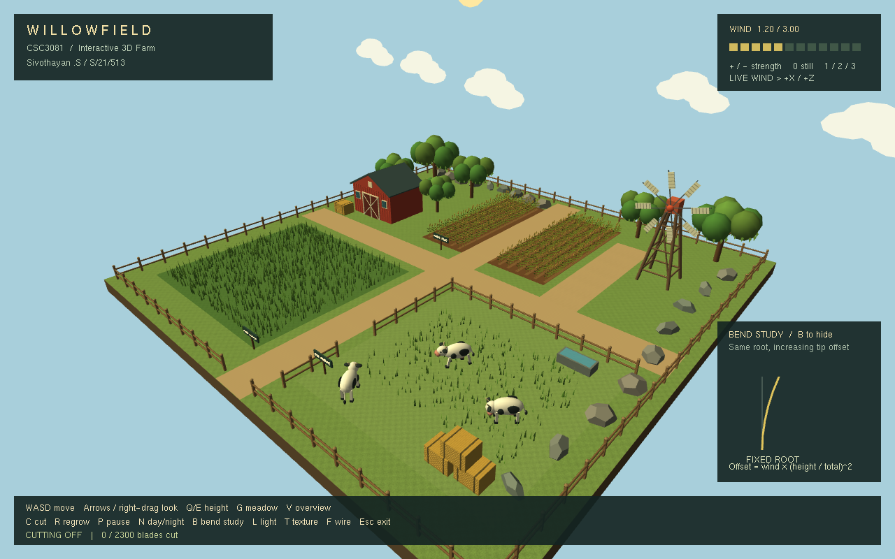

# Willowfield

Interactive 3D Farm Environment with Dynamic Vegetation and Structural
Deformation. Built with C++20, OpenGL and FreeGLUT for CSC3081.

**Author:** Sivothayan .S

**Registration number:** S/21/513



## Documentation

- [Complete Beginner Codebase Handbook (PDF)](docs/handbook/willowfield_codebase_handbook.pdf)
- [Complete Beginner Codebase Handbook source (LaTeX)](docs/handbook/willowfield_codebase_handbook.tex)
- [Beginner Code Walkthrough](docs/CODE_WALKTHROUGH.md)
- [Scripts and Development Tools](docs/SCRIPTS.md)
- [Third-Party Components](docs/THIRD_PARTY.md)

## Features

- Explore the farm freely or switch between front, back, side and barn views.
- Larger handwritten lettering and camera-facing signboards keep names readable
  from different angles.
- Adjust wind that bends grass, wheat, branches and leaves while keeping roots
  fixed.
- Cut meadow grass and restore it to its original height.
- Animated cows and windmill, farm structures, lighting, textures and day/night.
- An animated farmer in a straw hat and overalls tours the paths, wheat plots,
  meadow and pasture, stopping to inspect crops. At night he patrols around the
  cow barn with a lantern.
- At night, cows line up, enter the barn through automatic doors, and sleep in
  separate straw-lined stalls with hay storage. In the morning they return to
  the field.

## Build and run

On Windows, install Visual Studio 2026 with **Desktop development with C++**,
the Windows SDK and CMake tools. The solution uses the **v145** toolset. The
first build downloads FreeGLUT 3.8.0 and verifies its SHA-256 checksum, so
internet access is required. Later builds reuse the cache under ignored
`build/`. Textures are included.

Open `csc3081_farm_project.slnx`, select **Release | x64**, and press
**Ctrl+F5**. Alternatively, run from the project directory:

```powershell
.\scripts\build.ps1 -Configuration Release
.\build\x64\Release\csc3081_farm_project.exe
```

CMake is also supported from a Developer PowerShell:

```powershell
cmake -S . -B build/cmake -A x64
cmake --build build/cmake --config Release --parallel
.\build\cmake\Release\csc3081_farm_project.exe
```

Build and maintenance details are in [Scripts](docs/SCRIPTS.md).

## Controls

| Input               | Action                             |
| ------------------- | ---------------------------------- |
| W / A / S / D       | Move                               |
| Arrow keys          | Look around                        |
| Right mouse drag    | Look around                        |
| Q / E               | Lower / raise camera               |
| G / V               | Meadow view / overview             |
| H                   | View the barn interior             |
| J                   | Follow / release the farmer camera |
| U                   | Stop / resume the farmer           |
| Tab                 | Cycle through eight camera views   |
| F1                  | Overview                           |
| F2 / F3             | Farm front / back                  |
| F4 / F5             | Farm left / right                  |
| F6 / F7 / F8        | Barn center / left / right         |
| F9                  | Reload the shared text file        |
| F10                 | Hide / show on-screen help         |
| + or = / -          | Increase / decrease wind           |
| 0 / 1 / 2 / 3       | Wind off / low / medium / strong   |
| C / R               | Toggle cutting / restore grass     |
| P                   | Pause animation and cutting        |
| N                   | Toggle day/night                   |
| B                   | Toggle structural study            |
| L / T / F           | Lighting / textures / wireframe    |
| Esc or window close | Exit                               |

Press **G**, then **C**, and walk through the meadow to cut grass. Cutting works
near ground level; shortened grass remains until **R** is pressed.

The farmer walks automatically. Press **J** to follow him; press it again or
move the camera to leave follow mode. **U** stops only the farmer, while **P**
pauses the whole farm. **N** switches between the daytime tour and night patrol
and starts the cows' barn or morning routine. Use **H** to watch the stalls.

The HUD shows the farmer and herd activities. **B** toggles the structural
study; **F10** hides all overlays.

## Change the text

Edit [assets/text.txt](assets/text.txt), save, and press **F9** to reload
without rebuilding. It contains the title, author line, controls, camera names,
farmer and herd messages, farm signs and individual stall names. For example,
change `stall.1 = Stall 1` to `stall.1 = Buttercup`.

Keep the keys and `{placeholders}` unchanged. Use plain ASCII text with one
`key = value` per line.

## Development

Run the build, behavior, rendering and window-close checks with:

```powershell
.\scripts\verify.ps1
```

Run `.\scripts\format.ps1` to format the project, or add `-Check` to check
formatting. Build outputs belong in the ignored `build/` directory.
